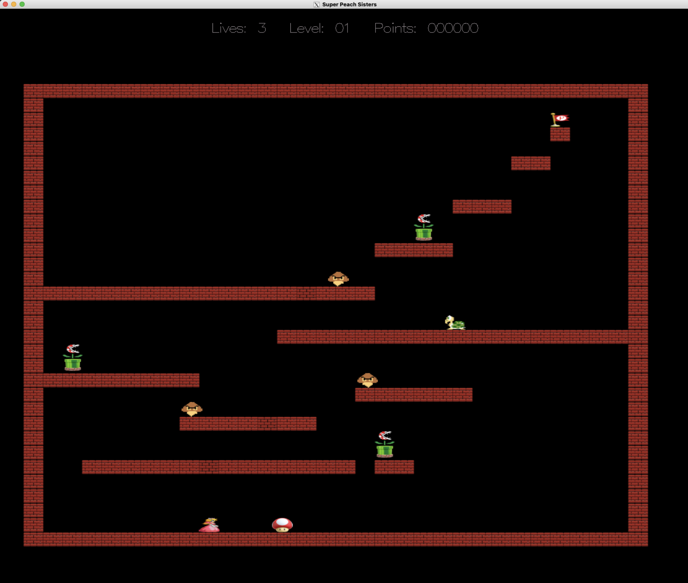

# super-peach-sisters
**Winter Quarter 2022 CS 32 Project 3**

Prof David Smallberg, UCLA

Score: 100/100

If you're a current CS 32 student, look for help from your TAs, professor, and/or TBP/HKN/UPE tutoring. This solution will not help you. Also, iterative programming is your best friend. 

## Project Introduction

NachenGames corporate spies have learned that SmallSoft is planning to release a new
video game called Super Peach Sisters, a sequel to Super Mario Brothers, and would like
you to program an exact copy so NachenGames can beat SmallSoft to the market. To
help you, NachenGames corporate spies have managed to steal a prototype Super Peach
Sisters executable file and several source files from the SmallSoft headquarters, so you
can see exactly how your version of the game must work (see posted executable file) and
even get a head start on the programming. Of course, such behavior would never be
appropriate in real life, but for this project, you’ll be a programming villain.
Super Peach Sisters is set in the Mushroom Queendom, fictional land of crazy creatures
like fire-breathing piranhas, koopas and goombas. Unfortunately, last week Mario was
taken hostage by the evil greenhouse gas producer named Yerac Grebnehcan (who is well
known for producing huge amounts of methane), and Peach must face a number of
increasingly difficult levels to rescue him.

Each level contains a number of challenges, which include dangerous koopas, goombas,
and fire-breathing Piranhas that grow from pipes. Peach must avoid or destroy these
creatures to reach the flag on each level, which takes her to the next level. Once Peach
reaches the final level, she must then get to Mario to save him and win the game. Each
level contains a number of goodies that Peach can reveal by bonking her head against
blocks. These goodies include Stars (which grant invincibility to Peach), Mushrooms
(which enable Peach to double her jumping height), and Flowers which enables Peach to
shoot fireballs at her opponents.

Screenshot from the game:

In the image above, we can see Peach in the bottom left of the screen. A mushroom
(which grants Peach extra-high jumping skill) is near her to the right. We also see three
piranhas sitting atop their pipes. Be careful, because they shoot fire from their mouths if
Peach gets too close. The brown pointy-headed characters are goombas, and the turtles
are koopas, both types of monster that cause Peach to shrivel up if she comes into contact
with them (unless she has a special power due to picking up a star, mushroom or flower).
At the top right, we see a flag which Peach must reach to complete the current level and
advance to the next level.
You, the player, will play the role of Peach and use the following keystrokes to control
her Peach:
* Left arrow key or the ‘a’ key: Moves Peach toward the left
* Right arrow key or the ‘d’ key: Moves Peach toward the right
* Up arrow key or the ‘w’ key: Causes peach to jump up
* Space bar: Fires a fireball, if Peach has any
* The ‘q’ key: Quits the game
* The ‘f’ and 'r' keys: Freeze and resume the game to aid with debugging